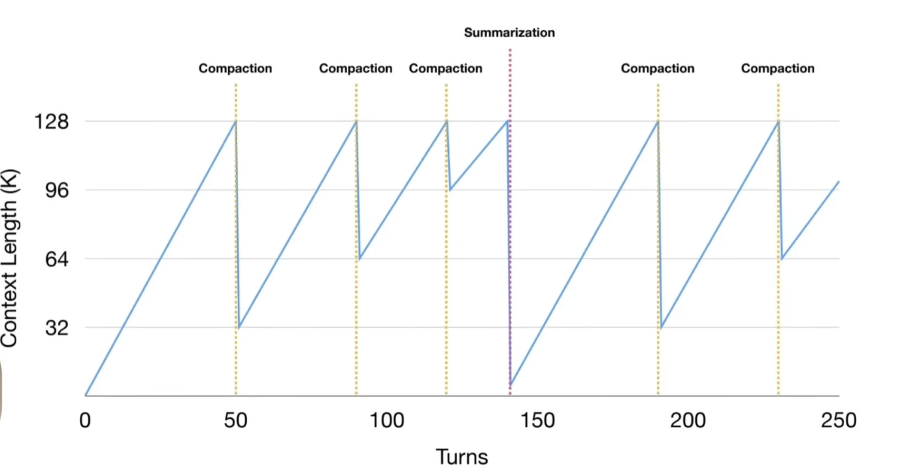

# Context 

## What is Context
It is the maximum number of tokens that your model can attend to at a certain inference call.

It is represented in:
- `Instructions`: system prompts, few-shot examples, and tool descriptions
- `Knowledge`: facts, retrieved documents, and memories
- `Tool feedback`: the results the agent pulls back mid-task

## Context Different Views
- `Context Rot`: The model attends to the wrong tokens prodcuing weird results.
- `Context Poisoning`: a hallucination enters the window and gets treated as fact
- `Context Clash`: Parts of the context disagree with each other.

## Context Management Techniques
1. **Offloading**:
    a. Keep the tools only a few "a dozen for example" but make them generic and powerful.
    b. You then offload these actions to scripts that run on the filesystem rather than tools.
2. **Reduction**:
    a. `Compaction`
    b. `Summarization`

3. **Isolating**: Leverage the use of sub agents and make use of `structured_output` in communication.
4. **Fine-tuning**: You can use fine tuning to increase the context window of the model.

# Time
How to save latency is a very important oncept

# Resources
- https://arxiv.org/pdf/2312.04511
- https://arxiv.org/pdf/2502.08235
- https://arxiv.org/pdf/2605.05980v1
- https://arxiv.org/pdf/2510.16786v2
- https://arxiv.org/pdf/2604.26102v1